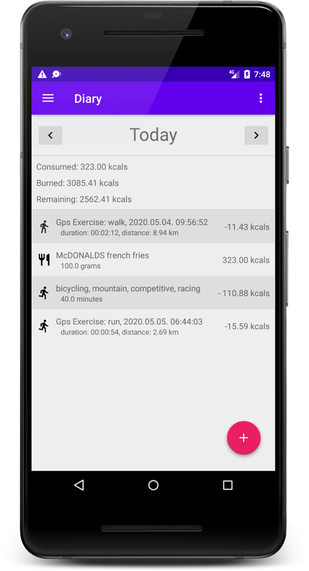
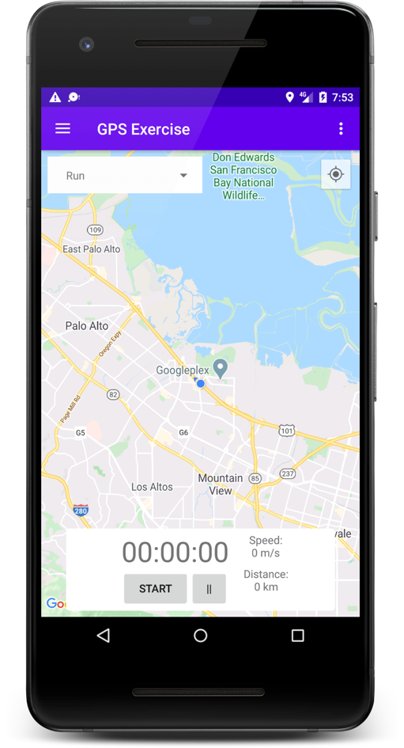
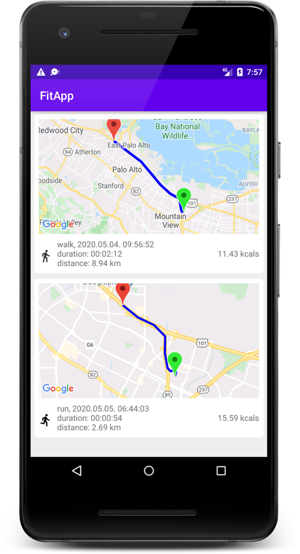

# FitApp
"Szoftverfejlesztés" nevezetű tárgy keretében elkészült projekt, kliens része.
. A hozzá tartozó szerver itt megtalálható: [https://github.com/1dle/Fitness](https://github.com/1dle/Fitness)

## Alapkoncepció
- Egy napló amiben napokra bontva tudjuk rögzíteni a bevitt illetve elégetett kalóriát
- Étkezéseket és Sport tevékenységeket tudunk hozzáadni
- GPS nyomkövetés segítségével, szabadban űzött sportok pontosabban felvihetők

## Rendszerkövetelmények
- Android Studio
- Megcélzott oprációs rendszer: Android 5.0 API 21

## Képernyőképek

## Felhasznált külső könyvtárak
- JSON fájlok feldolgozásához: [GSON](https://github.com/google/gson)
- HTTP kélrések küldése: [Retrofit](https://github.com/square/retrofit)
- felnyíló FloatingActionButton: [Floating Action Button](https://github.com/zendesk/sell-android-floating-action-button)
- [MaterialDialogs](https://github.com/afollestad/material-dialogs)
- [MaterialPopupMenu](https://github.com/zawadz88/MaterialPopupMenu)
- [MaterialSpinner](https://github.com/jaredrummler/MaterialSpinner)